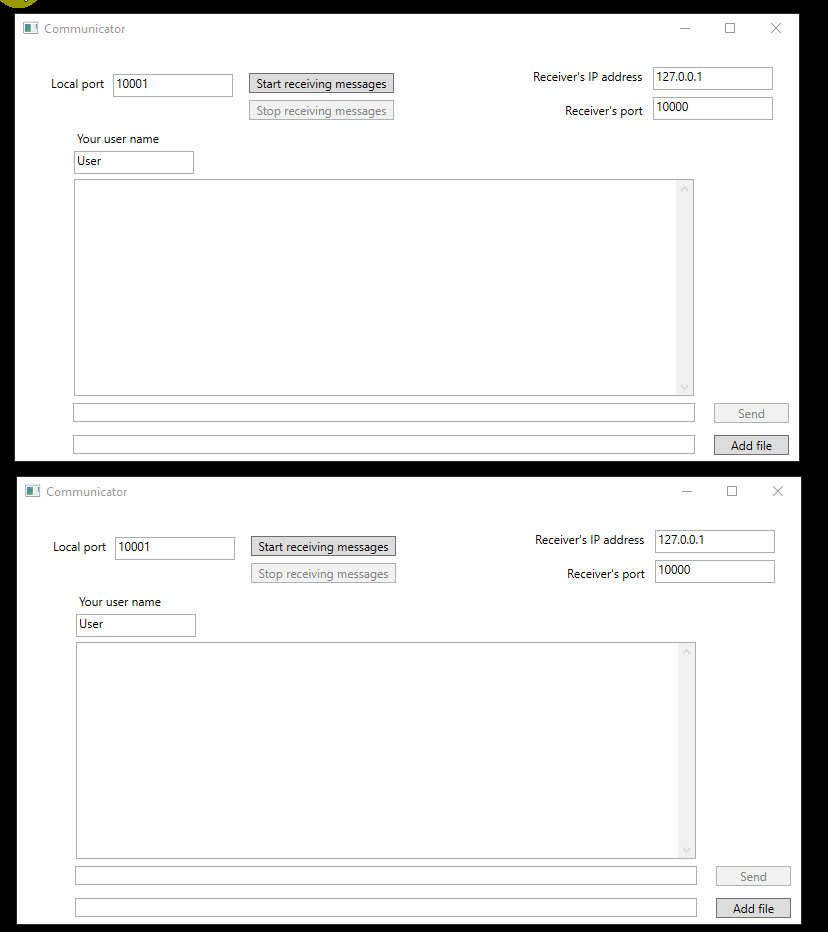

# PeerToPeerCommunicator

## Description
Simple peer-to-peer network communicator with support for sending of binary files.

## Technology stack
- C#
- WPF
- TCP communication
- XML serialization
- Base64 coding

